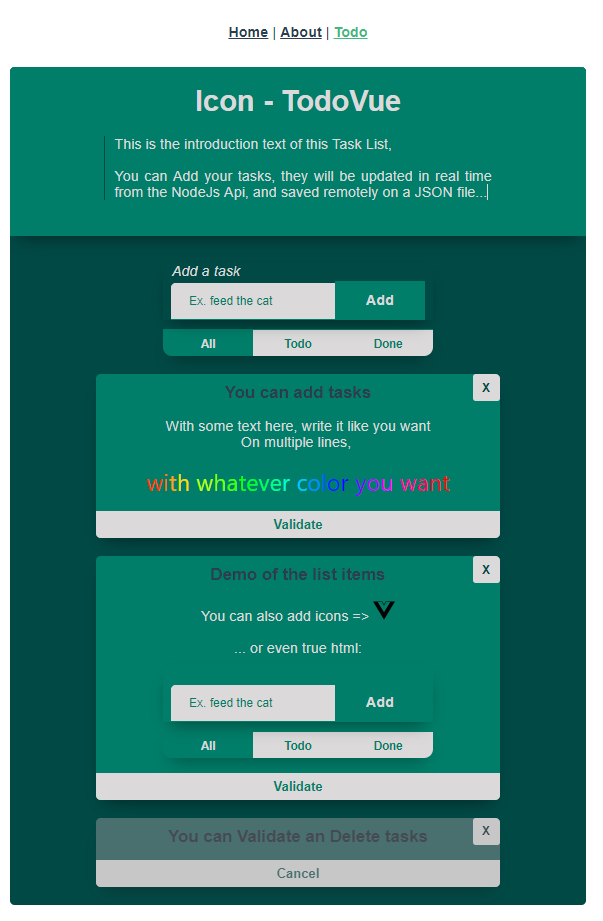

# TodoVue
<p align="center">
  
</p>

## Project setup
```
npm install
```

### Compiles and hot-reloads for development
```
npm run serve
```

### Compiles and minifies for production
```
npm run build
```

### Run your unit tests
```
npm run test:unit
```

### Lints and fixes files
```
npm run lint
```

## Setup Detail
- [Vue Application README](todo-vue/README.md)
- [Node Api README](todo-api/README.md)
